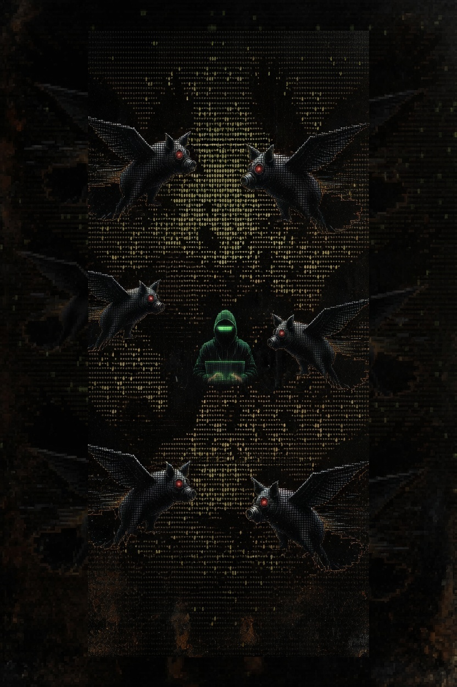

# OinkSpy
Pig-themed BLE surveillance detector for the Seeed Studio XIAO ESP32-S3.



OinkSpy is a customized `flock-you` fork adapted for the `Seeed Studio XIAO ESP32-S3` and the `XIAO Expansion Board v1.1`. It focuses on BLE-based surveillance detection with an on-device OLED UI, buzzer alerts, a phone-friendly web dashboard, and wardriving-oriented exports.

## Current Status
- Platform: `PlatformIO + Arduino`
- Target board: `seeed_xiao_esp32s3`
- Current firmware shape: single-file prototype in `src/main.cpp`
- Confirmed features: BLE detection, Raven UUID heuristics, OLED status, buzzer alerts, Wi-Fi AP dashboard, phone GPS tagging, fixed-port Grove GNSS, CSV/JSON/KML export, SPIFFS session persistence
- In-progress productization: WSL-first development workflow, XIAO Expansion Board integration, SD logging, physical controls, power management, OTA

## 60-Second Quickstart
For a fast smoke test, build the firmware, then launch the companion dashboard:

```bash
git clone https://github.com/Lunarhop/OinkSpy
cd OinkSpy
pio run
cd api
python -m venv .venv
. .venv/bin/activate
pip install -r requirements.txt
python flockyou.py
```

Expected results:

- `pio run` completes without board-package errors.
- `python flockyou.py` starts the Flask dashboard on `http://localhost:5000`.
- The device captive portal becomes available at `http://192.168.4.1` after boot.
- The dashboard can be exercised with either live serial data or imported JSON, CSV, or KML exports.

## Detection Coverage
OinkSpy currently detects likely surveillance hardware using BLE heuristics:

| Method | Description |
| --- | --- |
| MAC prefix matching | Known Flock Safety and related OUI prefixes |
| BLE device name patterns | Identifiers such as `FS Ext Battery`, `Penguin`, `Flock`, `Pigvision` |
| BLE manufacturer ID | `0x09C8` (`XUNTONG`) devices |
| Raven UUID detection | Service UUID fingerprinting for Raven gunshot detectors |
| Firmware estimation | Approximate Raven generation from advertised services |

## Hardware Baseline
Recommended hardware:

- `Seeed Studio XIAO ESP32-S3`
- `Seeed Studio XIAO Expansion Board v1.1`

Current and planned board mapping:

| XIAO Pin | GPIO | Function |
| --- | --- | --- |
| `D1` | `GPIO2` | Expansion board user button |
| `D2` | `GPIO3` | MicroSD chip select |
| `D3` | `GPIO4` | Expansion board buzzer |
| `D4` | `GPIO5` | I2C SDA for OLED and optional RTC |
| `D5` | `GPIO6` | I2C SCL for OLED and optional RTC |
| `D6` | `GPIO43` | GNSS UART RX |
| `D7` | `GPIO44` | GNSS UART TX |
| `D8` | `GPIO7` | SPI SCK for MicroSD |
| `D9` | `GPIO8` | SPI MISO for MicroSD |
| `D10` | `GPIO9` | SPI MOSI for MicroSD |
| `LED_BUILTIN` | `GPIO21` | Single-color status LED fallback |

Notes:

- OLED is expected on I2C address `0x3C`, with `0x3D` as a runtime fallback probe.
- The Expansion Board docs clearly cover OLED, button, buzzer, SD, Grove, battery charging, and RTC support.
- An onboard RGB LED is not currently treated as available; status feedback should assume buzzer + OLED + single-color LED unless extra hardware is added.

## WSL + VS Code + PlatformIO Workflow
OinkSpy is now documented as a `WSL-first` PlatformIO project.

Recommended workflow:

1. Open the repo in `VS Code Remote - WSL`.
2. Install `PlatformIO Core` inside WSL.
3. Run builds from WSL so `.pio/` stays local to your Linux environment.
4. Use whichever upload path is most reliable on your machine:
   - Recommended: build in WSL, flash and monitor from Windows PlatformIO when the USB device is attached to Windows as `COMx`.
   - Optional: upload and monitor directly from WSL if the device is passed through as `/dev/ttyUSB*` or `/dev/ttyACM*`.

Expected serial-port difference:

- Windows: `COMx`
- WSL/Linux: `/dev/ttyUSB*` or `/dev/ttyACM*`

## Building and Flashing
Requires `PlatformIO`.

### Build in WSL
```bash
git clone https://github.com/Lunarhop/OinkSpy
cd OinkSpy
pio run
```

### Upload Path A: Windows PlatformIO
Use this when the board is attached to Windows and exposed as `COMx`.

```bash
pio run -t upload
pio device monitor
```

### Upload Path B: WSL USB passthrough
Use this only if the device is reliably visible inside WSL.

```bash
pio run -t upload
pio device monitor
```

If upload from WSL is unstable, treat `build in WSL + flash in Windows` as the supported fallback rather than a blocker.

## Milestone 0 Environment Check
Before deeper firmware refactors, verify:

- `pio run` succeeds from your WSL environment
- the `seeed_xiao_esp32s3` board package resolves cleanly
- USB CDC logging works in the upload path you actually use
- at least one reproducible upload/monitor path is documented for your machine

Acceptance criteria:

- firmware builds reproducibly from WSL
- upload path is known and repeatable
- serial logs are readable after flash
- OLED and buzzer still respond on boot

## Dependencies
Current embedded dependencies in `platformio.ini`:

- `olikraus/U8g2@^2.35.19`
- `h2zero/NimBLE-Arduino@1.4.2`
- `ESP32Async/AsyncTCP@^3.3.2`
- `ESP32Async/ESPAsyncWebServer@^3.6.0`
- `bblanchon/ArduinoJson@^7.0.4`

Planned additions for the plug-and-play build:

- `SdFat` for MicroSD logging
- `Update.h` / Arduino OTA for firmware updates
- a small RTC wrapper for optional `PCF8563` support

## GPS Wardriving
OinkSpy now supports both browser GPS tagging and the Seeed Studio Grove - GPS (L76K) GNSS module over UART at `9600 8N1`.

On Android Chrome:

1. Open `chrome://flags`
2. Enable `Insecure origins treated as secure`
3. Add `http://192.168.4.1`
4. Relaunch Chrome
5. Connect to the device AP
6. Tap the GPS icon on the dashboard

Note: iOS Safari blocks geolocation over HTTP.

### Grove GNSS hardware
Supported today:

- Board/core: `Seeed Studio XIAO ESP32-S3` with `PlatformIO + Arduino`
- GNSS parser: `TinyGPS++`
- UART transport: `HardwareSerial(1)` with ESP32 pin remap

Connect the Grove - GPS (L76K) module to the fixed Grove UART wiring used by this firmware:

- `D6` = RX
- `D7` = TX

There is no runtime sweep or auto-detect logic. The firmware opens one known UART mapping and continuously parses NMEA from that fixed port.

### GNSS override options
Runtime config key in `config/oinkspy.json`:

- `gnss_enabled`

Compile-time overrides in `platformio.ini`:

```ini
build_flags =
    -DOINK_FEATURE_GNSS=1
    -DOINK_GNSS_BAUD=9600
    -DOINK_GNSS_UART_RX=D6
    -DOINK_GNSS_UART_TX=D7
    -DOINK_GNSS_HW_SERIAL_NUM=1
```

Use the build flags above if your board/core needs a different fixed UART mapping.

### Indicators

- `GPS: seen` appears on the OLED and in serial status once valid NMEA has been parsed.
- `Sats: N` shows the current TinyGPS++ satellite count. Until that field is valid, the OLED shows `Sats: -`.
- `LED_BUILTIN` follows GNSS visibility by default: off before NMEA is seen, on after valid GNSS traffic is parsed.

### Serial and API controls
Serial commands:

- `gnss status`

HTTP status endpoint:

- `GET /api/gnss`

Example serial output:

```text
[OINK-YOU] GNSS fixed UART ready: U1 RX=D6 TX=D7 baud=9600
[OINK-YOU] GPS: seen on U1 RX=D6 TX=D7 @ 9600
[OINK-YOU] Sats: 7
GNSS: port=U1 rx=D6 tx=D7 baud=9600 GPS: seen Sats: 7 Fix: yes HDOP: 0.90 last_ms=412
```

## Flask Companion Dashboard
A desktop analysis dashboard is available in `api/`.

```bash
cd api
pip install -r requirements.txt
python flockyou.py
```

Then open `http://localhost:5000`.

Common first-run flow:

1. Connect the XIAO board over USB and open the dashboard.
2. Choose the OinkSpy serial port and click `Connect`.
3. Optional: connect a USB GPS receiver for location-tagged detections.
4. If hardware is offline, use `Import` to load JSON, CSV, or KML exported by the device.

## Relationship to Flock-You
OinkSpy is a custom fork of the upstream project:

- Upstream: https://github.com/colonelpanichacks/flock-you
- This fork adds pig-themed UI and alerts, XIAO-targeted hardware support, firmware branding changes, and experimental wardriving features

## Disclaimer
This project is intended for:

- security research
- privacy auditing
- educational RF experimentation

Always comply with local laws regarding wireless scanning and radio use.
## Configuration

### Precedence

| Surface | Highest precedence | Then | Defaults |
| --- | --- | --- | --- |
| Firmware runtime | SD card `config/oinkspy.json` | compiled defaults in `src/oink_settings.cpp` | built-in defaults |
| Firmware GNSS wiring | `platformio.ini` `build_flags` | source defaults | built-in defaults |
| Companion serial discovery | `OINKSPY_SERIAL_PORTS` | pySerial / fallback glob scan | empty list |
| Companion UI settings | saved `api/data/settings.json` | in-memory defaults | `gps_port=""`, `flock_port=""`, `filter="all"` |
| Flask secret key | `SECRET_KEY` env var | dev fallback in `api/flockyou.py` | `flockyou_dev_key_2024` |

### Firmware SD Config

Place a JSON config file on the SD card at `config/oinkspy.json`.
A starter template is included at `config.oinkspy.example.json`.

| Key | Default | Notes |
| --- | --- | --- |
| `ap_ssid` | `oinkyou` | Soft AP name shown during phone setup |
| `ap_password` | `oinkyou123` | Captive portal password |
| `timezone` | `UTC0` | POSIX TZ string for timestamps |
| `ntp_enabled` | `true` | Enables network time sync |
| `ntp_server_1` | `pool.ntp.org` | Primary NTP server |
| `ntp_server_2` | `time.nist.gov` | Secondary NTP server |
| `buzzer_enabled` | `true` | Boot and alert audio feedback |
| `ble_scan_interval_ms` | `3000` | Time between scans |
| `standalone_scan_duration_sec` | `2` | Scan duration for AP-only mode |
| `companion_scan_duration_sec` | `3` | Scan duration when paired with companion tooling |
| `save_interval_ms` | `15000` | Session persistence cadence |
| `serial_timeout_ms` | `5000` | Serial command timeout |
| `sd_logging_enabled` | `true` | Master switch for SD logging |
| `sd_json_enabled` | `true` | Write JSONL log files |
| `sd_csv_enabled` | `true` | Write CSV log files |
| `gnss_enabled` | `true` when compiled in | Enables Grove GNSS reader |

## Troubleshooting

| Symptom | Likely cause | What to try |
| --- | --- | --- |
| `pio run` fails inside WSL | PlatformIO not installed in WSL or package cache issue | Reinstall `PlatformIO Core` in WSL and rerun `pio run` from the repo root |
| Board uploads fail from WSL | USB passthrough instability | Build in WSL, then upload from Windows PlatformIO against the `COM` port |
| Dashboard shows no serial ports | Data-only USB cable missing, board busy, or pySerial enumeration failed | Refresh ports, reconnect USB, close other serial monitors, or set `OINKSPY_SERIAL_PORTS=/dev/ttyUSB0,/dev/ttyACM0` |
| Phone GPS badge stays on `HTTP` | Browser blocks geolocation on insecure origins | On Android Chrome, add `http://192.168.4.1` to `chrome://flags` insecure origins; iOS Safari will not allow GPS over HTTP |
| Device portal shows `Storage: SD missing` | SD card absent or not mounted | Reseat the SD card, confirm the chip-select wiring on `D2`, and reboot |
| KML export has no points | Detections were not GPS tagged | Connect browser GPS or Grove GNSS before scanning, then export again |

